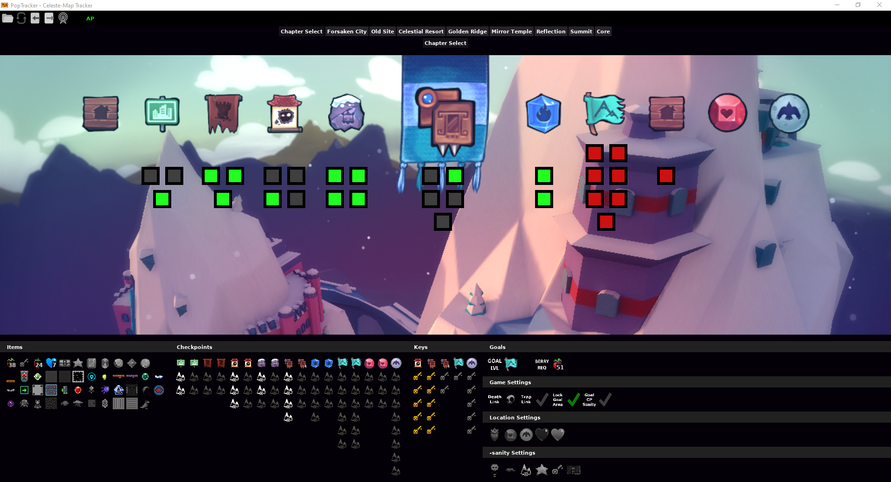

# Celeste-OW-Archipelago-Tracker

Poptracker Pack for [Celeste Archipelago Open World](https://github.com/PoryGoneDev/Celeste-Archipelago-Open-World), based on the work by [seto10987](https://github.com/seto10987), located [at his repository](https://github.com/seto10987/Celeste-AP-Tracker).

Archipelago Celeste pack for [PopTracker](https://github.com/black-sliver/PopTracker/) with Autotracking, built on PopTracker v0.33.0. This version or higher is recommended.

## Features

- Usable with Celeste Archipelago Open World
- Automated Map-based tracking for A-Side levels (Strawberries, Hearts, Cassettes, and Level Clears)
- Automatd Item tracking
- Automated Setting tracking on connection to the AP World
- Can theoretically be used manually, but this is untested

## Future Updates

- Base tracking logic for A-side locations
- Golden Berries
- Cleaner map layouts (some are quite hard to read right now)
- Automated tab switching
- Core and Farewell locations (and maps)
- B and C-side Maps
- The various "-sanity" checks and logic (Checkpoint, Bino, Key, Gem, Car, Room - not sure if I'll ever get to roomsanity)

## Installation

1. Ensure you have [PopTracker](https://poptracker.github.io/) installed. Make sure you know the folder where you installed PopTracker!
2. Download the repository. You can do this either by mousing over the "Code" button (above) and clicking "Download ZIP" or by opening the "Releases" page (right) and clicking on the ZIP file under the most recent release.

1. Move the file you just downloaded into the "packs" folder withing your PopTracker install folder. No need to unzip the download - PopTracker handles that for you.
2. Open PopTracker and select the newly installed package (it should be called something like "Celeste Open World Archipelago X.Y.Z"). It should open a map which looks similar to the image below.

## Use

This package is meant for use with an [Archipelago](https://archipelago.gg/) server. You can use it for manual tracking, but it was not coded for that use case so YMMV.

### Autotracking

If you are playing using an [Archipelago](https://archipelago.gg/) server, you can utilize the pack's autotracking functionality. Once connected, the pack will automatically track your location checks and items found.

To connect to the Archipelago server, load up the package and then click the "AP" icon in the upper left corner. The package will ask you to enter some basic inforamtion - your achipelago URL + port (e.g. "archipelago.gg:56884"), your player/slot name on the server (e.g. "john_archipelago" - this should match the name in your Archipelago YAML file), and your password (e.g. "hunter2" - leave this blank if you aren't using a password).

Once connected, that's it! Your settings and current checks/items should autopopulate - you can play and the tracker should handle everything for you.

### Manual

If you are not playing using an [Archipelago](https://archipelago.gg/) server, you'll have to track everything manually. You'll have to know a few things about to use the tracker in order to do this:

- First, setup your goals under the "Settings" heading - click on the image next to your selected goal to set it. For example, to set the goal at "50 strawberries", click the strawberry next to the "Berry Req" label 50 times. Yes, 50 times. Maybe I'll make this easier in the future.
- To navigate to your current map, click on any of the tabs at the top of the tracker. Note that most maps have "sub-maps" inside, so you may have to click multiple times to get to your current map (e.g. Clicking on "City" leads to three options: "Start", "Crossing", and "Chasm").
- Location checks are represented by squares on the map. Mouse over the square to see what checks are available at that location. Left click a location to mark it as "checked". Right click a location to unmark it as "checked" (in case you made a mistake or something).
- Location checks are color-coded based on the items you currently have. Green squares are currently "checkable". Red squares are not.
- Items obtained are tracked under the "Items" header near the bottom of the screen. Whenever you find an item, such as a Casette or Heart, make sure to mark if here. If you do not mark these items, your local "checkability" will not update correctly.

And that's about it! There are a few other details, but you'll have to figure them out on your own. Best of luck!

## Interested in Helping Out?

Interesting in helping maintain this package, modifying it to create your own version, or creating your own pack? Some of [these links](./docs/links.md) might help!

This pacakge is licensed using the MIT license, so you can use the code for whatever (don't feel like you have to contact me for permission, but I'd appreciate if you do use it, plesae add me to your thanks/credits in your code and README).
